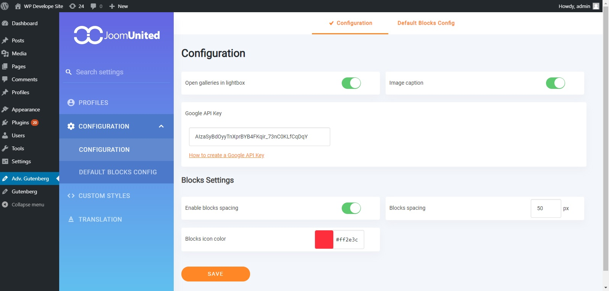
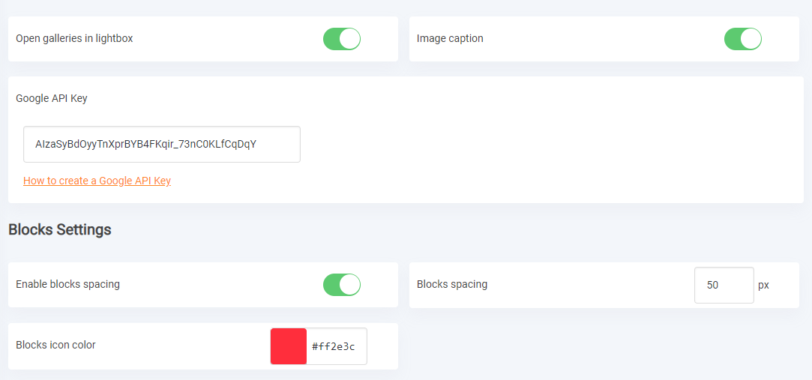
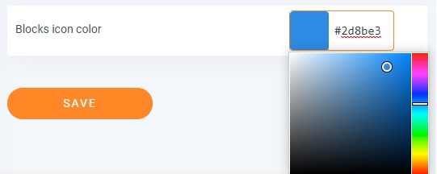
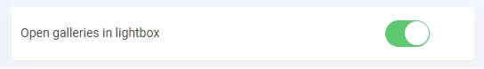
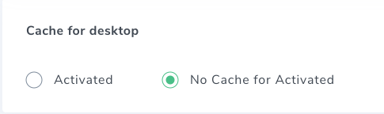
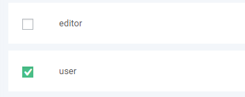
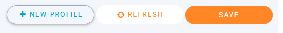
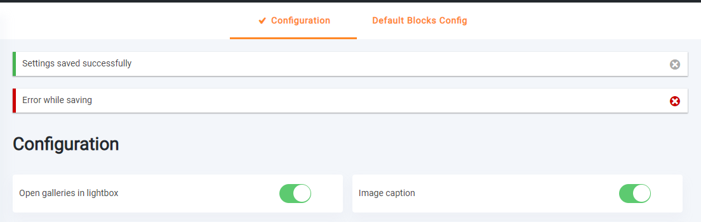

# JoomUnited WordPress FrameWork

This is framework using for all of Joomunited WP plugins backend UI.
In this framework content all styles and script needed for general elements and layouts.

**Extra online library**

- Roboto Font: `https://fonts.googleapis.com/css?family=Roboto`

## Overview

Main backend UI has 2 main sections: **Left Panel** and **Right Panel**.



Both of them are inside a div with `ju-main-wrapper` class.

**Example:**
```html
<div class="ju-main-wrapper">
	<div class="ju-left-panel">
		Your HTML code go here
	</div>
	
	<div class="ju-right-panel">
		Your HTML code go here
	</div>
</div>
```

## Left Panel

This section contains logo of the author and main menus of the plugin. Here are some elements inside it:

- **Logo:** This element using class `ju-logo` for its styles.

	```html
	<div class="ju-logo">
		<a href="http://linktoyourwebsite.com" target="_blank" title="Visit my site">
			
		</a>
	</div>
	```

- **Menu search**: This is using for search the menu of the left panel,
  as well as searching the setting options that inside the Right Panel with class `ju-settings-option`.
  
	```html
	<div class="ju-menu-search">
		<i class="mi mi-search ju-menu-search-icon"></i>
		<input type="text" class="ju-menu-search-input" placeholder="Search settings" />
	</div>
	```

- **Menu list**: This is the list of menu (settings) of the plugins.
  Sub menus of each menu will be added automatically when you add them to its tab content.
  This menu required `tab.js`, `velocity.min.js` and `wave.js`.

	```html
	<ul class="tabs ju-menu-tabs">
		<li class="tab">
			<a href="#your-tab-id-1" class="link-tab waves-effect waves-light">Your tab text 1</a>
		</li>
		<li class="tab">
			<a href="#your-tab-id-2" class="link-tab waves-effect waves-light">Your tab text 2</a>
		</li>
	</ul>
	```

  **Note:** The tab content with id show in tab href `your-tab-id-...`, we will let them stay inside Right Panel tab,
  not include them here right now.

## Right Panel

This section is use to show the content of each menu (setting) which we include on the **Left Panel** `ju-menu-tabs` before.

Each menu container we make separate div with class `ju-content-wrapper` with the id is exactly same as `href` we are place in menu tabs.

```html
<div class="ju-right-panel">
	<div class="ju-content-wrapper" id="your-tab-id-1">
		Your contents go here	
	</div>
	
	<div class="ju-content-wrapper" id="your-tab-id-2">
		Your contents go here	
	</div>
</div>
```

Here are some of `ju-content-wrapper` main elements:

- **Top Tabs (Sub menus):** This is the sub menus of each settings. The settings can have sub menus or not.
  This tab not using `waves-effect`.
  
  **NOTE:** This sub menus will *automatically* add to it parent menu settings on the **Left Panel**

	```html
	<div class="ju-top-tabs-wrapper">
		<ul class="tabs ju-top-tabs">
			<li class="tab">
				<a href="#your-sub-tab-id-1" class="link-tab">Your sub tab text 1</a>
			</li>
			<li class="tab">
				<a href="#your-sub-tab-id-2" class="link-tab">Your sub tab text 2</a>
			</li>
		</ul>
	</div>
	```

- **Setting option**: Each option of this menu (submenu).
  The label must using class `ju-setting-label` for using in search function on **Left Panel**.
  
  Each option will take 50% width, to make it full width, add `full-width` class along with `ju-settings-option`.
  
  Setting separator has class `settings-separator` along with `ju-settings-option` class.
  Its title has class `settings-separator-title`. Setting separator takes 100% width.

	

	```html
	<div>
		<div class="ju-settings-option full-width">
			<label for="your-setting-option-id-1" class="ju-setting-label">Setting Label</label>
			<input type="text" class="ju-input" id="your-setting-option-id-1" name="your-setting-name" />
		</div>
	</div>
	```

Each settings control elements has its own designed styles. See below.

## Element styles

### Input control elements

Elements using for control setting input like `<input>`, `<select>`, `checkbox`, `radio`.

- **Input Element:** Element `input` with `type` value is `text, number` will using class `ju-input`.
  This class can also use for `jquery minicolors` input picker.

	
	
	```html
	<div class="ju-settings-option">
		<label for="your-setting-option-id-1" class="ju-setting-label">Setting Label</label>
		<input type="text" class="ju-input minicolors minicolors-input" id="your-setting-option-id-1" name="your-setting-name" />
	</div>
	```

- **Switch button:** Setting with function to on/off will using this.

	

	```html
	<div class="ju-settings-option">
		<label for="your-setting-option-id-1" class="ju-setting-label">Setting Label</label>
		<div class="ju-switch-button">
			<label class="switch">
				<input type="checkbox" name="your-setting-name" id="your-setting-option-id-1" value="1" checked />
				<span class="slider"></span>
			</label>
		</div>
	</div>
	```

- **Radio button:** Using class `ju-radiobox`.

	

	```html
	<input type="radio" class="ju-radiobox">
	```

- **Checkbox button:** Using class `ju-checkbox`.

	

	```html
	<input type="checkbox" class="ju-checkbox">
	```

### Button Elements

Using general class `ju-button` for all buttons with curved `border-radius`.



From left to right:

- The first button only has class `ju-button`.
- The second button has addition class `orange-outline-button`.
- The third button has addition class `orange-button`.

**Rectangular Button:** This button using class `ju-rect-button`.


**Square button:** This button using class `ju-material-button`.


### Notice Message

This is using to show message to user after saving settings.
Successful message using class `ju-notice-success`, error message using class `ju-notice-error`.



```html
<div class="ju-notice-msg ju-notice-success">
	Settings saved successfully
	<i class="dashicons dashicons-dismiss ju-notice-close"></i>
</div>
```

Close message has `slideUp` effect.